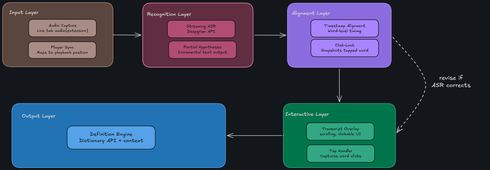

# EchoLex

> Real-time, click-to-define lookup for podcast audio

**Status:** 🚧 In development — Sprint 1 of 5

## What is this?

A software to generate real-time transcript for uncaptioned audio content with a click-to-define 
meaning lookup for unfamiliar words and sentences

## Tech stack

- Frontend: JavaScript
- Speech recognition: Deepgram API
- Dictionary lookup: Free Dictionary API *(planned, not yet integrated)*

## Quick start

```bash
git clone https://github.com/L-Raghav/echolex-poc.git
cd echolex-poc

#Add a test audio file
#save the file as sample.mp3 at assets/audio/sample.mp3

python -m http.server 8000

```

-Open http://localhost:8000 in your browser
-click the "Start Capture" button
-press play and check browser console for audio capture

## Architecture

EchoLex captures live audio from the browser, streams it to Deepgram for real-time transcription, and displays the time-synced, clickable transcript with on-demand definitions using Dictionary API.



*Note: this is the target architecture. Check out the [Development Journey](#development-journey) below for what has been built so far.*


##development-journey

This project is being built and documented sprint by sprint. Each
write-up covers what was built, why, and what I learned along the way.

- **Sprint 0** — Capturing raw audio playing in the browser → [full write-up](docs/sprint-0-report.md)
- **Sprint 1** — [one-line description] → [full write-up](docs/sprint-1-report.md)
- *(add a new line here at the end of each sprint)*


## Roadmap

- **Phase A (08/26 → 11/26):** local web-page prototype proving the core NLP pipeline — audio capture, live transcription, click-to-define
- **Phase B (December onward):** port into a real cross-platform Chrome extension, with cross-platform player support


