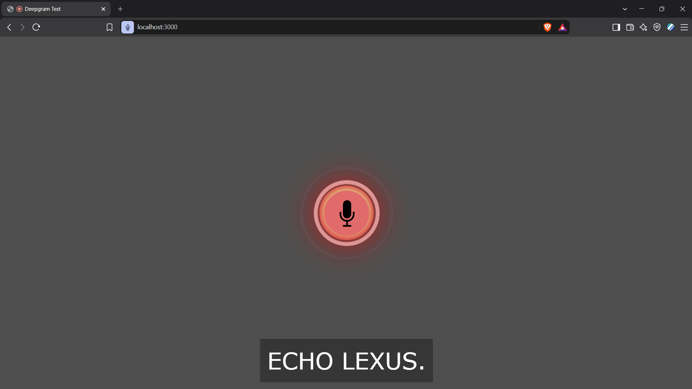

# EchoLex — Sprint 1 Report: Live Transcription with Deepgram


**Status:** 🚧 Ongoing — Ticket 1 complete, Tickets 2–5 in progress
**Goal:** Prove that live audio input can be transcribed in real time using Deepgram's API — the first real step toward turning captured audio into an on-screen transcript.

---

## 1. Why This Sprint Exists

Sprint 0 proved we could capture live audio as it plays in the browser. That capture is useless on its own, though,` the next step is turning that audio into actual text, live, as it's spoken. This sprint verified that piece in isolation: before wiring anything into our own EchoLex code, we needed to confirm that mic audio *can* reach Deepgram and come back as a real transcript, using Deepgram's own official reference implementation.

## 2. What Was Tested

Cloned and ran [`deepgram-devs/js-live-example`](https://github.com/deepgram-devs/js-live-example), Deepgram's official minimal example for live transcription:

```
js-live-example/
├── README.md
├── .gitignore
├── .env.example
├── package.json
├── package-lock.json
├── server.js
└── public/
    ├── client.js
    ├── index.html
    └── style.css
```

Using a Deepgram API key with **Member**-level permissions (a specific role requirement flagged in their docs), we tested whether mic audio could be streamed live and transcribed back onto the page.

## 3. When Things Went Sideways 🕵️

The transcription didn't work on the first try - which turned out to be fun to debug through rather than a setback. The troubleshooting process:

- The browser console showed a WebSocket connecting, then immediately closing (`CloseEvent`), before the microphone had even finished opening, a strong signal of an auth/permissions issue rather than a real network problem.
- First suspect: a `404` also showing in the console. Investigating the **Network tab** (not just Console) showed the actual API calls the temporary auth token fetch and the WebSocket upgrade-both succeeding (`200` and `101`). That ruled out the 404 theory; it was later identified as just the browser's routine, harmless `favicon.ico` request.
- Second check: the Deepgram key's role. Confirmed it was already set to **Member**, so that wasn't it either.
- Eventually retried the whole flow cleanly, and it worked: **"ECHO ECHO ECHO"** appeared on screen from live mic input, proving the full pipeline (mic → WebSocket → server → Deepgram → transcript → page) end to end.

**Bonus finding:** "EchoLex" itself got transcribed as **"ECHO LEXUS"** — since "EchoLex" isn't a real English word, the ASR model matched it to the closest *real* word it knew (a car brand).



This is a real, captured example of exactly the kind of ambiguity EchoLex's planned **audio-anchored disambiguation** feature is meant to solve — when the model is uncertain, instead of silently committing to a confident-but-wrong guess like "Lexus," the system would let the listener replay just that snippet and pick the correct word before a definition is looked up.

## 4. Lesson Learned 💡

Running `npm i` flagged several dependency vulnerabilities (via `npm audit`). After looking into it: none of them were a real concern *here*, because this server only listens on `localhost` - meaning no other device can send it requests. The distinction that matters is **inbound vs. outbound**: nothing external can reach in, while the one outbound connection this app makes is to a trusted API (Deepgram) I explicitly chose to talk to. That's a different risk profile than a publicly deployed server would have - which is exactly why this becomes something to actually act on once EchoLex's real extension is public in Phase B, rather than something to fix now.

## 5. What's Next 🔮

Sprint 1 proved live transcription works *in isolation*, using Deepgram's own demo code. Ticket 2 goes one level deeper: reading through `client.js` and `server.js` line by line to actually understand *how* that demo works, before adapting the same pattern into EchoLex's own codebase in Ticket 4.
